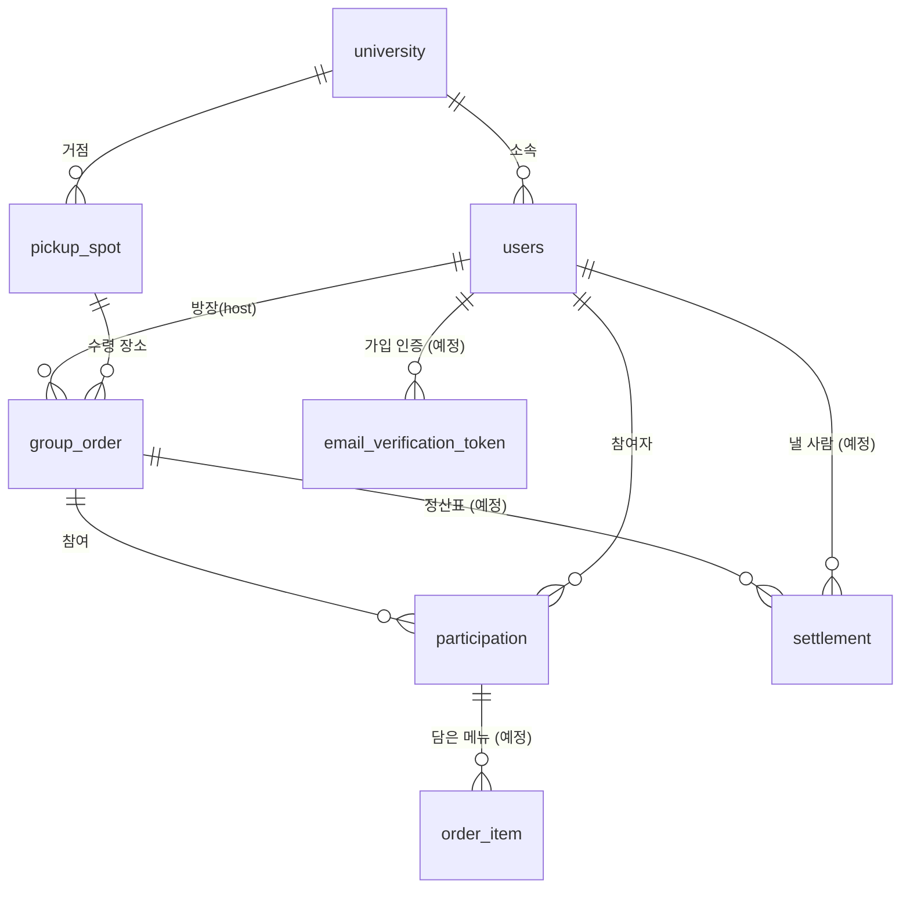

# Bandal - 배달음식 공동구매

## 1. 무엇을 만드는가

1인분만 먹고 싶은데 가게의 최소주문금액이 그보다 높아서, 먹지도 않을 메뉴를 억지로
담게 되는 문제를 푼다. 같은 수령 거점(기숙사 로비, 캠퍼스 건물 등)에 있는 사람들이
같은 가게에서 각자 1인분씩 담아 최소주문금액을 함께 채우고, 음식이 도착하면 각자
가져간다. 방장이 대표로 배달앱에서 주문하고, Bandal은 모집 / 메뉴 취합 / 정산 계산을
담당한다.

**대학 단위 서비스다.** 학교 이메일로만 가입할 수 있고, 거래는 같은 학교 안에서만
일어난다. 트리거는 "지금 배고픈데 혼자 시키기엔 최소주문금액이 부담된다".

대학으로 좁힌 이유

- 매칭에 필요한 "같은 시각 x 같은 가게 x 같은 수령지" 교집합이 캠퍼스에서는 실제로
  생긴다. 도보 몇 분 거리에 같은 시간대에 배고픈 사람이 수백 명 있다.
- 학교 이메일이 신원 확인과 거점 자격 확인을 동시에 해준다. 별도의 거점 인증 절차가
  필요 없다.
- 수령 장소가 자연스럽게 정해진다. 기숙사 로비, 건물 앞처럼 모두가 아는 지점이 이미
  있다.
- 나중에 학교와의 제휴로 확장할 여지가 있다.

배달비 절약은 부가 효과지 핵심이 아니다. 배달비는 이미 배달앱들이 알뜰배달 같은
걸로 어느 정도 눌렀지만, 최소주문금액은 가게가 정하는 값이라 아무도 못 건드린다.

## 2. 핵심 시나리오

1. A가 기숙사 로비 거점에 "○○마라탕 / 19:30 마감 / 최소주문 15,000원" 방을 연다.
   자기 메뉴(8,000원)를 먼저 담는다.
2. 같은 거점의 B가 모집중인 방 목록에서 이 방을 본다. `8,000 / 15,000 (53%)`로 표시된다.
3. B가 참여해 메뉴명과 가격을 직접 입력한다(마라탕 소, 9,000원). 합계 17,000원이 되어
   최소주문금액을 넘긴다.
4. 마감 시각이 되거나 방장이 직접 마감하면 방이 `마감` 상태가 된다. 이후 참여와 메뉴
   변경은 막힌다.
5. 방장이 배달앱에서 실제로 주문한 뒤, 총 결제금액과 배달비를 Bandal에 입력한다
   -> `주문완료`.
6. Bandal이 1인당 낼 금액을 계산해 정산표를 만든다. B에게 "9,000 + 배달비 분담 1,500
   = 10,500원"과 송금 링크가 보인다.
7. 음식이 도착하면 방장이 `배달완료`로 바꾸고, 참여자들이 거점에서 각자 가져간다.
8. 방장이 입금을 확인하며 체크한다. 전원 확인되면 `정산완료`.

## 3. 결정해야 하는 것

### 결정한 것

- **결제**: 가게 결제는 방장이 배달앱에서 하므로 Bandal이 관여하지 않는다. 참여자가
  방장에게 보내는 내부 송금은 앱이 돈을 받아 전달하지 않는다. 그렇게 하면 돈이 잠깐이라도
  플랫폼에 머물러 전자금융거래법상 자금이체업/선불전자지급수단 발행업 등록이 필요해진다.
  대신 계좌번호와 금액 복사 버튼을 기본으로 깔고, 토스/카카오페이 송금 딥링크를 얹는다.
  딥링크는 공식 공개 API가 아니라 동작 확인이 필요하므로 복사 버튼이 폴백이자 웹에서의
  주력이다. 입금 여부는 방장이 체크한다.
- **배달비 분담**: 무조건 균등. 배달비는 메뉴 금액과 아무 관련이 없다(20,000원어치
  담았다고 배달차가 두 번 오지 않는다). 정산식은 아래 한 줄이 전부다.

  ```
  참여자가 방장에게 보낼 금액 = 내 메뉴 합계 + (배달비 / 참여인원)
  ```

  배달비가 나누어떨어지지 않으면 원 단위로 버리고 나머지는 방장이 흡수한다. 방장은
  주문 수고를 하는 사람이고, 참여자에게 청구하는 금액이 항상 깔끔해진다.
  "N원 이상 주문 시 배달비 무료" 같은 케이스는 방장이 배달비 0을 입력하면 되므로
  별도 분기가 필요 없다.
- **주문**: 방장이 배달앱에서 대표로 주문. 가게/메뉴 연동은 하지 않는다. 배달앱 메뉴
  크롤링은 약관 위반이라 애초에 선택지가 아니다. 메뉴는 참여자가 이름과 가격을 직접
  입력하고 방장이 검수한다.
- **범위**: 대학 단위. `University` 아래에 `PickupSpot`(기숙사 로비, 건물 앞)이 달린다.
  방은 거점에 속하므로 자연히 학교 안에서만 매칭된다.
- **실시간성**: 초기에는 폴링. WebSocket은 필요해진 게 확인되면 그때 넣는다.
- **인증**: 로컬 회원가입만. 학교 이메일 + 비밀번호로 가입하고 인증 메일을 통과해야
  활성화된다. OAuth는 쓰지 않는다. Spring Security + JWT, 리프레시 토큰과 로그아웃
  블랙리스트는 Redis에 둔다.
- **회원가입이 곧 거점 자격 확인이다**: 학교 이메일 인증을 통과하면 그 학교 소속이
  확정되고, 그 학교의 모든 거점에 접근할 수 있다. 별도의 거점 인증 개념은 두지 않는다.
- **대학은 학교 단위, 이메일 도메인은 학교당 하나**: University에 `emailDomain` 컬럼을
  두고 전체에서 unique로 막는다. 이메일만 보면 소속 학교가 하나로 정해진다. 캠퍼스는
  따로 두지 않고 거점 이름으로 구분한다. 도메인이 여러 개인 학교가 확인되면 그때 테이블로
  뺀다. (ADR-014)
- **인증 메일 발송**: 로컬 개발에서는 Mailpit 컨테이너로 받아서 웹 UI로 확인한다.
  실제 발송은 배포 시점(Phase 2)에 정한다.

### 아직 갈리는 것

8번 열린 질문으로.

## 4. 도메인 모델

| 개념 | 설명 | 주요 필드 |
| --- | --- | --- |
| University | 대학 (학교 단위) | id, name, emailDomain (unique, ADR-014) |
| User | 사용자 | id, universityId, email(unique), password(해시), nickname(unique), emailVerifiedAt(null이면 미인증), trustScore(int, 50에서 시작) (ADR-015, 016) |
| EmailVerificationToken | 가입 인증 토큰 | id, userId, token, expiresAt, usedAt |
| PickupSpot | 수령 거점 | id, universityId, name, description (좌표 없음, ADR-013) |
| GroupOrder | 공구방 | id, hostId, pickupSpotId, storeName, minOrderAmount, deadlineAt, capacity, status(이름으로 저장), deliveryFee(주문 전 null), totalPaidAmount(기록용, nullable), cancelReason(취소된 방만), cancelType(취소된 방만, 이름으로 저장) (ADR-017, 021) |
| Participation | 방 참여 (방장 포함) | id, groupOrderId, userId, joinedAt. (groupOrderId, userId) unique. 이탈하면 행 삭제 (ADR-019) |
| OrderItem | 담은 메뉴 | id, participationId, menuName, price, quantity |
| Settlement | 정산 내역 | id, groupOrderId, userId, itemTotal, feeShare, totalDue, paidAt |

관계

- University 1 - N User, University 1 - N PickupSpot
- User 1 - N GroupOrder (방장으로서)
- User 1 - N EmailVerificationToken (재전송하면 여러 개가 쌓인다)
- GroupOrder 1 - N Participation, Participation 1 - N OrderItem
- PickupSpot 1 - N GroupOrder
- GroupOrder 1 - N Settlement



User가 University를 직접 들고 있으므로 "이 방에 참여할 자격이 있는가"는
`user.universityId == groupOrder.pickupSpot.universityId` 한 줄로 끝난다.

capacity는 방장이 정한다. 인원이 많을수록 배달비 분담은 싸지지만, 수령 시 로비에
사람이 몰리고 메뉴가 뒤섞이면 나눠 가져가기가 곤란해진다. 상한이 필요한 이유는
배달비가 아니라 수령이다.

지켜야 하는 불변식

- `마감` 이후에는 Participation과 OrderItem을 변경할 수 없다.
- Participation 수는 capacity를 넘을 수 없다. (Phase 3 동시성 문제의 핵심)
- 방장 포함 2명 이상이어야 마감할 수 있다. 혼자 시킬 거면 배달앱에서 바로 시키면 된다.
  이 검사는 정산 계산기가 아니라 GroupOrder의 마감 전이에서 한다. (ADR-011)
- 각 참여자의 `totalDue = itemTotal + feeShare`.
- `feeShare = floor(deliveryFee / 참여인원)`이고, 모든 참여자의 feeShare 합계와
  deliveryFee의 차액은 방장이 부담한다.
- totalPaidAmount는 방장이 배달앱에서 실제 결제한 금액이다. 쿠폰이나 결제수단 할인
  때문에 `메뉴 합계 + 배달비`와 다를 수 있으므로 정산식에는 쓰지 않고 통계용으로만
  기록한다.

## 5. 상태 흐름

```
모집중 -> 마감 -> 주문완료 -> 배달완료 -> 정산완료
  |        |
  +--------+--> 취소
```

- 모집중 -> 마감: 마감 시각 도달 또는 방장의 수동 마감. 방장 포함 2명 이상, 메뉴 합계가
  최소주문금액 이상이어야 마감된다. 조건이 안 되면 수동 마감은 거부되고(모집중 유지),
  마감 시각 도달은 자동 취소된다. (ADR-020)
- 마감 -> 주문완료: 방장이 실제 주문 후 배달비를 입력하는 시점(총 결제금액은 선택 입력).
  이때 정산표가 생성된다.
- 주문완료 -> 배달완료 -> 정산완료: 방장이 전이시킨다. 정산완료는 모든 참여자의
  입금 확인이 끝나야 가능.

취소 규칙

- 방 전체 취소는 방장만 한다. `모집중`에서는 언제든(사유 선택). `마감` 상태에서는 사유를
  남겨야 한다. `주문완료` 이후에는 취소 불가(이미 돈이 나갔으므로).
- 취소된 방은 지우지 않고 `취소` 상태로 남긴다. 취소 종류(방장-모집중, 방장-마감 뒤,
  마감 시각 미달)를 함께 남겨 나중에 신뢰도 감점 근거로 쓴다. (ADR-021)
- 참여자 개별 이탈: `모집중`에서만 자유롭게. `마감` 이후에는 불가.

## 6. 기술 스택

- 언어/프레임워크: Java + Spring Boot — 도메인 설계와 테스트를 보여주기 좋고 취업
  포트폴리오로 가장 무난하다.
- DB: PostgreSQL — 정산 금액 계산에 정확한 수치 타입이 필요하고, 나중에 지도 기반
  거점 탐색을 붙이게 되면 위치 확장(PostGIS) 여지가 있다.
- 클라이언트: React (별도 진행) — 백엔드는 REST API로 분리.
- Redis: 리프레시 토큰 저장과 로그아웃 블랙리스트, 마감 직전 동시 참여 제어(분산 락),
  거점별 모집중 방 목록 캐싱, 마감 임박 정렬(ZSET).
- Kafka: 방 상태 변경 이벤트를 알림 컨슈머와 통계 적재 컨슈머가 독립적으로 소비.
  컨슈머 그룹이 둘 이상이고 통계 쪽은 오프셋을 되감아 재처리해야 하므로 선택.
- Spring Batch: 일별 통계 집계, 신뢰도 점수 일괄 재계산.
- Prometheus + Grafana + k6: 동시성 문제를 재현하고 개선을 수치로 증명하는 용도.
- AWS + GitHub Actions: 배포와 CI/CD.

원칙: 위 항목들은 "써봤다"가 아니라 "이 문제가 이렇게 터졌고 이렇게 고쳤다"로
설명할 수 있어야 한다. 그게 안 되는 항목은 뺀다.

## 7. 이번 단계에서 만들 것

각 단계는 **배포된 채로 동작하는 상태**로 끝난다. 다음 단계로 안 넘어가도 그 자체로
완결된 결과물이어야 한다.

### Phase 1 — 도메인 코어와 REST API

순서대로. 도메인이 먼저 서야 인증이 무엇을 지켜야 하는지가 선명해진다.

1. 도메인 코어 — 4번 모델과 5번 상태 흐름, 정산 계산기(배달비 균등 분담,
   나누어떨어지지 않는 나머지는 방장이 흡수). 외부 의존이 없는 순수 로직이라
   테스트로 바로 확정할 수 있다.
2. Spring Security + 학교 이메일 회원가입 + JWT. 리프레시 토큰과 로그아웃
   블랙리스트는 Redis.
3. 이메일 인증 — 토큰 발급, 만료, 재전송 제한. 로컬에서는 Mailpit으로 확인.

- 계좌번호/금액 복사와 송금 딥링크용 정산 정보 응답
- Testcontainers 기반 통합 테스트
- 완료 기준: API 호출만으로 2번 시나리오 1~8번이 끝까지 돌아간다

### Phase 2 — 배포와 CI/CD

- Docker, AWS(EC2 또는 ECS), RDS, GitHub Actions
- 여기서 React 최소 화면을 붙여 실제로 써볼 수 있게 한다
- 완료 기준: main에 push하면 자동 배포되고, 브라우저로 방을 만들고 참여할 수 있다
- 일부러 앞으로 당겼다. 뒤로 미루면 안 하게 되고, 여기서 해두면 이후 모든 단계가
  실제 환경에서 굴러간다

### Phase 3 — 동시성 문제 재현과 해결

- 락 없는 순진한 구현을 그대로 두고, 마감 직전 동시 참여로 정원 초과를 **실제로 재현**
- 낙관적 락 -> Redis 분산 락 순으로 고치면서 각각의 한계를 확인
- 거점별 방 목록 캐싱과 캐시 무효화
- 완료 기준: 깨지는 케이스와 고친 뒤의 결과가 로그/테스트로 남는다

### Phase 4 — 부하 테스트와 관측

- k6로 Phase 3의 시나리오를 부하 상태에서 재현
- Prometheus + Grafana로 개선 전후 비교
- 완료 기준: 개선 전후 그래프가 남는다

### Phase 5 — Kafka와 알림 분리

- 방 상태 변경 이벤트 발행
- 컨슈머 둘: 알림 발송, 통계 적재
- 통계 컨슈머 장애 시 오프셋 되감기 재처리 확인
- 완료 기준: 알림 서버를 내려도 본 서비스가 멀쩡하고, 복구 후 밀린 이벤트를 따라잡는다

### Phase 6 — Spring Batch

- 일별 통계 집계(거점별 매칭 성공률, 누적 절약 금액)
- 신뢰도 점수 일괄 재계산, 미정산 방 리마인드
- 더미 데이터를 대량으로 넣고 단건 처리 대비 청크 처리 성능 비교
- 완료 기준: 배치 실행 시간이 유의미하게 측정된다

### 나중에 (Phase 6 이후, 여유가 있으면)

- PG 샌드박스(포트원/토스페이먼츠 테스트 모드)로 결제 흐름 구현. 웹훅 멱등성, 결제
  상태와 정산 상태 동기화, 결제 실패 롤백은 좋은 소재다. 단 이건 "참여자 -> 플랫폼"
  모델이라 실제 서비스로는 못 쓰는 기술 데모이므로 메인 흐름에 박지 않고 별도로 둔다.

### 나중에

- 채팅 (방 상태와 정산표로 초기에는 충분하다. 붙이면 개발량이 몇 배가 된다)
- WebSocket 실시간 갱신
- 아파트 단지 등 캠퍼스 외 거점
- 평판/제재 시스템의 본격적인 설계
- 지도 기반 거점 탐색 (붙일 때 PickupSpot에 좌표 컬럼을 추가한다. ADR-013)

## 8. 열린 질문

- **방장이 쿠폰이나 결제수단 할인을 받은 경우** 그 할인을 방장이 가져가는가, 참여자와
  나누는가. 지금은 방장 몫으로 두고 정산식에 반영하지 않는다. 단순함을 택한 것이고
  나중에 불만이 나오면 다시 본다.
- **방장이 최소주문금액을 채우려고 자기 메뉴를 추가로 담은 경우** 정산에서 어떻게
  구분할지. 아니면 구분하지 않아도 되는지.
- **토스/카카오페이 송금 딥링크가 실제로 동작하는지** 직접 확인해야 한다. 공식
  문서화된 API가 아니라 스킴이 바뀔 수 있다. 안 되면 계좌번호 복사만으로 간다.
- **University를 누가 등록하나.** 초기에는 운영자가 직접 넣는 수밖에 없어 보인다.
  허용 이메일 도메인도 학교마다 조사해서 넣어야 한다. 관리자 화면이 필요한 시점은
  언제인가.
- **졸업생과 휴학생.** 학교 이메일이 살아있는 한 계속 쓸 수 있는데, 그게 맞는가.
  당장 막을 이유는 없어 보이지만 언젠가 정해야 한다.
- **인증 메일을 실제로 무엇으로 보낼지.** Gmail SMTP는 발송량 제한이 있고 AWS SES는
  샌드박스 해제 심사가 필요하다. Phase 2 배포 시점에 정한다.
- **비밀번호 재설정 플로우가 Phase 1에 필요한가.** 이메일 인증 토큰 구조를 거의
  그대로 재사용할 수 있어서 같이 하는 게 싸 보이기는 한다.
- **노쇼와 미입금 제재를 어디까지 할지.** trustScore를 도메인에 넣긴 했지만 어떻게
  쌓고 어떻게 쓸지는 아직 모르겠다. 방장은 전원 몫을 먼저 결제하므로(정원 10명이면
  20만 원 안팎) 미입금 위험을 방장이 떠안는다. 앱이 돈을 받아두는 방식은 ADR-002로
  막혀 있으니, 정원 상한, 신뢰도 낮은 사람의 참여 제한, 미입금 제재로 줄이는 쪽을 검토한다.
- **한 사람이 같은 시간대에 여러 방에 참여할 수 있는가.**
- **최소주문금액을 못 채운 채 마감 시각이 온 방을 자동 취소하는 게 맞는지.** 방장이
  "그냥 내가 더 담아서 진행할게"를 선택할 수 있어야 할 수도 있다.
